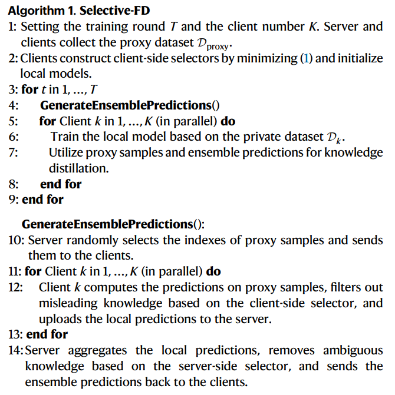
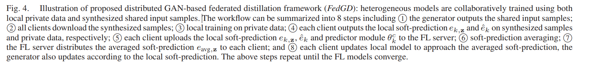
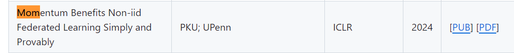

# This is a paper reading log.

Log my master learning period.

before 2024/6/14

**title:** FedDWA: Personalized Federated Learning with Dynamic Weight Adjustment

**source:** [[2305.06124\] FedDWA: Personalized Federated Learning with Dynamic Weight Adjustment (arxiv.org)](https://arxiv.org/abs/2305.06124)

主要贡献就是在PFL中，简化了两个客户端的距离公式，使用拉格朗日数乘法求解最优解。使用了多做一次训练作为guidance。

---

2024/6/14

**title:** Selective knowledge sharing for privacy preserving federated distillation without a good teacher  

**DOI:** https://doi.org/10.1038/s41467-023-44383-9  

nature communications

code: https://github.com/shaojiawei07/ Selective-FD  

***

2024/6/16

**title**: Federated Linear Contextual Bandits with Heterogeneous Clients  

**code**: https://github.com/blaserethan/HetoFedBandit

不是很懂

---

2024/6/17

**title**: Towards Data-Independent Knowledge Transfer in Model-Heterogeneous Federated Learning 

**source**: IEEE TRANSACTIONS ON COMPUTERS, VOL. 72, NO. 10, OCTOBER 2023  

GAN+FD

---

2024/6/18

**title**: Scheduling Algorithms for Federated Learning With Minimal Energy Consumption  

**source**: IEEE TRANSACTIONS ON PARALLEL AND DISTRIBUTED SYSTEMS, VOL. 34, NO. 4, APRIL 2023  

method: (MC)2MKP and dynamic programming

this paper focuses on the energy cost in FL

跟联邦学习关系不大，没有考虑Non-IID，而且没有FL训练效果 

不推荐看

**title**: PrivAim: A Dual-Privacy Preserving and Quality-Aware Incentive Mechanism for Federated Learning  

**source**: IEEE TRANSACTIONS ON COMPUTERS, VOL. 72, NO. 7, JULY 2023  

对隐私感兴趣可以看，对具体的FL训练没有实质性进展

**title**: FedRFQ: Prototype-Based Federated Learning With Reduced Redundancy, Minimal Failure, and Enhanced Quality  

**source**: IEEE TRANSACTIONS ON COMPUTERS, VOL. 73, NO. 4, APRIL 2024  

conclude: 原型+softpool+practical byzantine fault-tolerance

主要突破就是减少了通信量 acc提升量还行

在GitHub上的浏览位置为

---

下载了相对比较高质量的文章耗时半天。

---

2024/6/19

**title**: User-Distribution-Aware Federated Learning for Efficient Communication and Fast Inference

**source**: IEEE TRANSACTIONS ON COMPUTERS, VOL. 73, NO. 4, APRIL 2024

个人见解：FL框架没什么创新。只是考虑了一个edge或者cluster的重要性，以及设计了LB-Net来减少通讯量。没啥贡献。亮点可能就是证明吧。

可以参考证明思路

---

2024/6/20

**title:** Coalitional FL: Coalition Formation and Selection in Federated Learning with Heterogeneous Data

**source**: DOI 10.1109/TMC.2024.3375325

好文章。分析了异构性和model acc的关系。

---

2024/6/23

**title**: A Coalition Formation Game Approach for Personalized Federated Learning

**source**: arXiv:2202.02502v2

Good Paper

recommended

**title**: A Data Privacy Protection Scheme Integrating  Federal Learning and Secret Sharing

**source**: 2023 IEEE 5th International Conference on Power, Intelligent Computing and Systems (ICPICS) DOI: 10.1109/ICPICS58376.2023.10235406

对数据使用密码学加密，学过密码学就知道这个特别基础 

本文没有什么贡献。

**title**:  FedMut: Generalized Federated Learning via Stochastic Mutation

**source**: TheThirty-Eighth AAAI Conference on Artificial Intelligence (AAAI-24)

对参数进行变异后进行聚合。既然对参数进行变异，其实可以启发使用遗传算法。

**title**:  Competitive-Cooperative Multi-Agent Reinforcement Learning for Auction-based Federated Learning

**source**: Proceedings of the Thirty-Second International Joint Conference on Artificial Intelligence (IJCAI-23)

介绍了AFL。可以参考其定义

个人绝对就是调整那个τ超参数来管理整个RL

---

2024/6/24

**title**: FEDGKD: Toward Heterogeneous Federated Learning via Global Knowledge Distillation

**source**: IEEE TRANSACTIONS ON COMPUTERS, VOL. 73, NO. 1, JANUARY 2024

特点就是global模型将历史模型做了一个buffer，进行平均聚合

**title**: FairTrade: Achieving Pareto-Optimal Trade-Offs between Balanced Accuracy and Fairness in Federated Learning

**source**: TheThirty-Eighth AAAI Conference on Artificial Intelligence (AAAI-24)

多目标优化的FL

---

2024/7/12

**title:**Boosting with Multiple Sources

**source**: 35th Conference on Neural Information Processing Systems (NeurIPS 2021).

集成学习+fed 里面的Q函数可以研究研究

**title**:  ADAPTIVE FEDERATED OPTIMIZATION

**source**: ICLR 2021

这个真的抽象，就是server端，自适应选择优化器 adam这种。

---

2024/7/13

**title**: WHAT DO WE MEAN BY GENERALIZATION IN FEDERATED LEARNING?

**source**: ICLR 2022

 participation gaps can quantify client dataset heterogeneity. 讨论泛化能力。以及提出一些重要的指标。

----

2024/7/14

title:  BAYESIAN CORESET OPTIMIZATION FOR PERSONALIZED FEDERATED LEARNING

source: ICLR 2024

需要了解贝叶斯核心集优化。

title: FEDERATED LEARNING VIA POSTERIOR AVERAGING: A NEW PERSPECTIVE AND PRACTICAL ALGORITHMS

source: ICLR 2021

使用蒙特卡洛采样拟合后验，然后用这些来作为聚合的权重。

---

2024/7/20

title：SIMPLE MINIMAX OPTIMAL BYZANTINE ROBUST AL GORITHM FOR NONCONVEX OBJECTIVES WITH UNI FORM GRADIENT HETEROGENEITY

source：ICLR 2024

好！建议精读！

---

2024/7/24

title:  Aligning model outputs for class imbalanced non‑IID  federated learning

source:  [Aligning model outputs for class imbalanced non-IID federated learning | Machine Learning (springer.com)](https://link.springer.com/article/10.1007/s10994-022-06241-5)

建议精读。

---

title: FedSampling: A Better Sampling Strategy for Federated Learning

source:  arXiv:2306.14245v1

具有参考价值，针对训练样本的公平性，采用的计算方法都是基于伯努利分布。

---

2024/7/23

title: Federated Learning under Heterogeneous and Correlated Client Availability

source: DOI: 10.1109/INFOCOM53939.2023.10228876

理论性很强。需要细读

---

2024/7/29

title: Stochastic Controlled Averaging for Federated Learning with Communication Compression

source:  arXiv:2308.08165v1

简化了scaffold的公式，移项后，只需要上传一个特定的部分，然后使用动量。

理论分析比较多，可以作为以后的数学分析参考。

---

2024/8/3

title: DIURNAL OR NOCTURNAL? FEDERATED LEARNING OF MULTI-BRANCH NETWORKS FROM PERIODICALLY SHIFTING DISTRIBUTIONS

source:  ICLR 2022 Google

可以细读

文心一言：

### 核心内容

1. 联邦学习中的周期性分布变化：
   - 周期性变化：客户端的可用性随时间的推移而变化，导致数据分布在白天和夜间模式之间逐渐转变，这种变化可能导致训练不稳定性和模型性能下降。
   - 建模方法：不同于以往的块循环模式（block-cyclic pattern），本文提出了一个更直观的混合分布模型（mixture of distributions），逐渐在白天和夜间模式之间转换。
2. 多分支网络和聚类模型的联合训练：
   - 分配策略：提出了一种联合训练聚类模型和多分支网络的方法，根据客户端的特征表示为不同模式的客户端分配轻量级的专用分支。
   - 优点：这些轻量级分支仅略微增加了通信成本，但显著提高了模型性能。此外，基于特征的聚类模型不依赖于标记数据，可以轻松地应用于新客户端的推理。
3. 时间先验的利用：
   - 时间先验：假设每个通信轮次中的参与客户端是白天和夜间客户端的混合体，且白天客户端的数量随时间从夜间向白天逐渐增加，反之亦然。
   - 优点：利用这一先验信息，可以训练出比使用均匀采样客户端进行训练的模型更准确的模型。
4. 实验与结果：
   - 数据集：在EMNIST、CIFAR和Stack Overflow三个基准数据集上进行了模拟实验，以评估在周期性分布变化下FL算法的性能。
   - 结果：实验结果表明，通过本文方法训练的多分支网络在分布变化的各种程度上，比忽略分布变化的基线方法表现出色，性能提升显著。

### 算法结构

1. 建模周期性分布变化：
   - 设定周期T，并假设在每个周期内，客户端以概率q(t)来自白天模式I1(t)，其中q(t)是一个周期性的线性或余弦函数，可以平滑地在0和1之间变化。
2. 多分支网络设计：
   - **共享特征提取层**：所有分支共享一部分特征提取层，以学习通用的特征表示。
   - **专用分支**：为白天和夜间模式分别设计轻量级的专用分支，用于最终的预测。
3. 聚类模型的联合训练：
   - **高斯混合模型（FED TEM）**：使用高斯混合模型（GMM）对客户端的特征表示进行聚类，以区分白天和夜间模式的客户端。
   - **K-means聚类（FED TKM）**：另一种方法是使用K-means聚类算法进行客户端的聚类。
4. 时间先验的引入：
   - 在聚类过程中，利用时间先验信息来增强聚类模型的准确性。具体来说，可以根据一天中的时间调整聚类的超参数或权重，以更好地反映客户端的实际分布情况。
5. 优化与训练：
   - 在每个通信轮次中，服务器广播全局模型给参与训练的客户端。客户端在本地数据上进行计算，并将模型更新发送回服务器。服务器根据客户端的更新和聚类结果，更新全局模型和分支权重。

### 总结

本文通过建模周期性分布变化、联合训练多分支网络和聚类模型、以及利用时间先验信息，提出了一种有效的方法来应对联邦学习中客户端数据分布的周期性变化。实验结果表明，该方法能够显著提高模型在周期性分布变化下的性能。

### 多分支网络的结构

多分支网络主要由两部分组成：

1. **共享特征提取层（Shared Feature Extraction Layers）**：这部分是所有分支共用的，用于从输入数据中提取通用的特征表示。这些特征对于不同时间段的客户端来说都是共通的，有助于提高数据效率和表示学习的效果。
2. **特化预测分支（Specialized Prediction Branches）**：每个分支对应于一个特定的时间段或客户端群集，负责从共享特征中提取出特定于该时间段或群集的特征，并做出最终的预测。每个分支的结构通常比整个网络简单，例如，可以是一个单层的线性层，以减少通信开销和数据需求。

### 算法结构

为了训练这种多分支网络，文中提出了两种主要的算法结构，分别结合了不同的聚类方法和时间先验：

1. Federated Expectation-Maximization with Temporal Prior (FedTEM)
   - **聚类模型**：使用高斯混合模型（Gaussian Mixture Model, GMM）来推断客户端属于哪个群集（日间或夜间），并选择对应的网络分支。
   - **时间先验**：在GMM的参数更新中，利用时间先验来正则化群集的混合系数，从而增强模型对不同时间段客户端数据分布变化的适应能力。
   - 训练过程：
     1. 服务器广播当前的网络参数和GMM参数给参与训练的客户端。
     2. 每个客户端使用其本地数据估计GMM参数，并选择对应的网络分支进行训练。
     3. 客户端将本地训练后的网络更新和GMM更新发送回服务器。
     4. 服务器聚合这些更新并更新全局模型和网络参数。
2. Federated K-means with Temporal Prior (FedTKM)
   - **聚类模型**：使用K-means聚类方法来推断客户端的群集归属，并基于特征到群集中心的平均距离来选择网络分支。
   - **时间先验**：通过调整不同群集中心的距离权重（α参数），在客户端的本地训练中强制执行时间先验。
   - 训练过程：
     1. 服务器广播当前的网络参数和K-means参数给参与训练的客户端。
     2. 每个客户端计算其数据到不同群集中心的平均距离，并选择距离最小的分支进行训练。
     3. 客户端训练后，将本地更新和网络参数发送给服务器。
     4. 服务器聚合这些更新，并更新全局模型和K-means参数。

### 优点与适用性

多分支网络的优势在于它能够针对来自不同时间段或分布的数据进行特化学习，从而提高模型的性能和泛化能力。此外，由于网络分支相对较轻，这种结构在通信效率和数据效率方面也更具优势。这使得多分支网络特别适用于那些客户端数据分布随时间周期性变化的联邦学习场景。

在实际应用中，这种多分支网络可以应用于多种领域，如图像分类、自然语言处理、推荐系统等，在这些领域中客户端的数据分布可能会随时间和地区的变化而变化。通过引入时间先验和聚类模型，多分支网络能够更好地适应这些变化，从而提供更准确和高效的预测结果。

code: [federated/periodic_distribution_shift at 7525c36324cb022bc05c3fce88ef01147cae9740 · google-research/federated (github.com)](https://github.com/google-research/federated/tree/7525c36324cb022bc05c3fce88ef01147cae9740/periodic_distribution_shift)

---

2024/8/3

title:  UNDERSTANDING CONVERGENCE AND GENERALIZATION IN FEDERATED LEARNING THROUGH FEATURE LEARNING THEORY

source: ICLR 2024

gpt：

1. 研究背景与动机：
   - 联邦学习作为一种有效的隐私保护分布式学习方法，在多个客户端上协同训练全局模型，尽管已有大量实证研究和应用，但对其收敛性和泛化性的系统理论理解仍有限。
   - 现有工作多集中于FedAvg在权重空间中的懒惰训练（lazy training）下的收敛性分析，这些分析依赖于线性化假设。
2. 研究目标与贡献：
   - 建立了一个基于特征学习理论的统一理论框架，以理解FedAvg的收敛性和泛化性。
   - 分析了FedAvg在信号学习和噪声记忆轨迹上的表现，无需线性化假设。
   - 揭示了FedAvg通过有效增加特征学习中的信噪比（SNR）来实现接近零的测试误差，而无通信的本地训练则会产生较大的恒定测试误差。
   - 提出了基于客户端输入特征相似性的加权FedAvg方法，以解决FL中的数据异质性问题。
3. 理论框架与方法：
   - 引入了一个两层数据分布模型，模拟FL中的数据收集，包括信号块和噪声块。
   - 研究了每个客户端中两层卷积神经网络（CNN）在FedAvg下的动态，比较了信号和噪声的学习速度。
   - 证明了FedAvg在多项式时间内可以实现接近零的训练误差，并分析了其与本地算法的泛化差距。
4. 实验结果与验证：
   - 在合成数据集和真实世界数据集上进行了实验，验证了理论结论。
   - 实验结果表明，加权FedAvg方法在提高模型性能和处理数据异质性方面表现优异。
5. 加权FedAvg算法：
   - **算法概述**：加权FedAvg是一种个性化的联邦学习方法，其权重基于客户端输入特征的相似性进行分配。这种方法旨在提高全局模型对各个客户端数据的适应性，减少数据异质性对模型性能的影响。
   - 实现细节：
     - 在每个通信轮次中，服务器首先收集来自各个客户端的本地模型更新。
     - 然后，服务器根据预定义的相似性度量（如特征分布的相似性）计算每个客户端的权重。
     - 使用这些权重对本地模型更新进行加权平均，以生成新的全局模型。
     - 最后，将更新后的全局模型发送回各个客户端，以供下一轮本地训练使用。
6. 未来研究方向：
   - 进一步探索特征学习理论在更复杂神经网络结构和训练算法中的应用。
   - 研究如何在不同的数据分布和异构性条件下优化加权FedAvg方法。
   - 验证加权FedAvg在实际应用中的有效性和可行性。

---

2024/8/3
