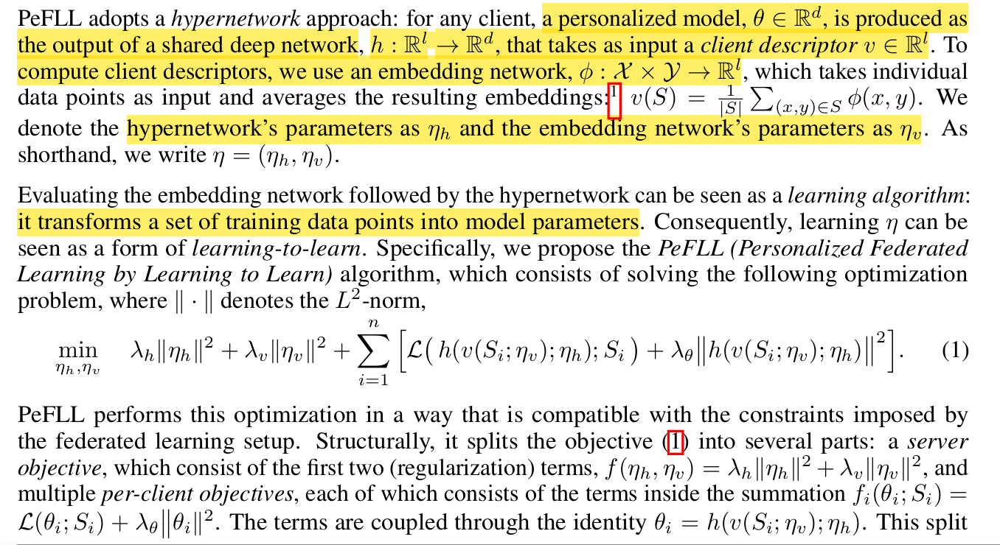

# This is a paper reading log.

Log my master learning period.

before 2024/6/14

**title:** FedDWA: Personalized Federated Learning with Dynamic Weight Adjustment

**source:** [[2305.06124\] FedDWA: Personalized Federated Learning with Dynamic Weight Adjustment (arxiv.org)](https://arxiv.org/abs/2305.06124)

主要贡献就是在PFL中，简化了两个客户端的距离公式，使用拉格朗日数乘法求解最优解。使用了多做一次训练作为guidance。

---

2024/6/14

**title:** Selective knowledge sharing for privacy preserving federated distillation without a good teacher  

**DOI:** https://doi.org/10.1038/s41467-023-44383-9  

nature communications

code: https://github.com/shaojiawei07/ Selective-FD  

***

2024/6/16

**title**: Federated Linear Contextual Bandits with Heterogeneous Clients  

**code**: https://github.com/blaserethan/HetoFedBandit

不是很懂

---

2024/6/17

**title**: Towards Data-Independent Knowledge Transfer in Model-Heterogeneous Federated Learning 

**source**: IEEE TRANSACTIONS ON COMPUTERS, VOL. 72, NO. 10, OCTOBER 2023  

GAN+FD

---

2024/6/18

**title**: Scheduling Algorithms for Federated Learning With Minimal Energy Consumption  

**source**: IEEE TRANSACTIONS ON PARALLEL AND DISTRIBUTED SYSTEMS, VOL. 34, NO. 4, APRIL 2023  

method: (MC)2MKP and dynamic programming

this paper focuses on the energy cost in FL

跟联邦学习关系不大，没有考虑Non-IID，而且没有FL训练效果 

不推荐看

**title**: PrivAim: A Dual-Privacy Preserving and Quality-Aware Incentive Mechanism for Federated Learning  

**source**: IEEE TRANSACTIONS ON COMPUTERS, VOL. 72, NO. 7, JULY 2023  

对隐私感兴趣可以看，对具体的FL训练没有实质性进展

**title**: FedRFQ: Prototype-Based Federated Learning With Reduced Redundancy, Minimal Failure, and Enhanced Quality  

**source**: IEEE TRANSACTIONS ON COMPUTERS, VOL. 73, NO. 4, APRIL 2024  

conclude: 原型+softpool+practical byzantine fault-tolerance

主要突破就是减少了通信量 acc提升量还行

在GitHub上的浏览位置为

---

下载了相对比较高质量的文章耗时半天。

---

2024/6/19

**title**: User-Distribution-Aware Federated Learning for Efficient Communication and Fast Inference

**source**: IEEE TRANSACTIONS ON COMPUTERS, VOL. 73, NO. 4, APRIL 2024

个人见解：FL框架没什么创新。只是考虑了一个edge或者cluster的重要性，以及设计了LB-Net来减少通讯量。没啥贡献。亮点可能就是证明吧。

可以参考证明思路

---

2024/6/20

**title:** Coalitional FL: Coalition Formation and Selection in Federated Learning with Heterogeneous Data

**source**: DOI 10.1109/TMC.2024.3375325

好文章。分析了异构性和model acc的关系。

---

2024/6/23

**title**: A Coalition Formation Game Approach for Personalized Federated Learning

**source**: arXiv:2202.02502v2

Good Paper

recommended

**title**: A Data Privacy Protection Scheme Integrating  Federal Learning and Secret Sharing

**source**: 2023 IEEE 5th International Conference on Power, Intelligent Computing and Systems (ICPICS) DOI: 10.1109/ICPICS58376.2023.10235406

对数据使用密码学加密，学过密码学就知道这个特别基础 

本文没有什么贡献。

**title**:  FedMut: Generalized Federated Learning via Stochastic Mutation

**source**: TheThirty-Eighth AAAI Conference on Artificial Intelligence (AAAI-24)

对参数进行变异后进行聚合。既然对参数进行变异，其实可以启发使用遗传算法。

**title**:  Competitive-Cooperative Multi-Agent Reinforcement Learning for Auction-based Federated Learning

**source**: Proceedings of the Thirty-Second International Joint Conference on Artificial Intelligence (IJCAI-23)

介绍了AFL。可以参考其定义

个人绝对就是调整那个τ超参数来管理整个RL

---

2024/6/24

**title**: FEDGKD: Toward Heterogeneous Federated Learning via Global Knowledge Distillation

**source**: IEEE TRANSACTIONS ON COMPUTERS, VOL. 73, NO. 1, JANUARY 2024

特点就是global模型将历史模型做了一个buffer，进行平均聚合

**title**: FairTrade: Achieving Pareto-Optimal Trade-Offs between Balanced Accuracy and Fairness in Federated Learning

**source**: TheThirty-Eighth AAAI Conference on Artificial Intelligence (AAAI-24)

多目标优化的FL

---

2024/7/12

**title:**Boosting with Multiple Sources

**source**: 35th Conference on Neural Information Processing Systems (NeurIPS 2021).

集成学习+fed 里面的Q函数可以研究研究

**title**:  ADAPTIVE FEDERATED OPTIMIZATION

**source**: ICLR 2021

这个真的抽象，就是server端，自适应选择优化器 adam这种。

---

2024/7/13

**title**: WHAT DO WE MEAN BY GENERALIZATION IN FEDERATED LEARNING?

**source**: ICLR 2022

 participation gaps can quantify client dataset heterogeneity. 讨论泛化能力。以及提出一些重要的指标。

----

2024/7/14

title:  BAYESIAN CORESET OPTIMIZATION FOR PERSONALIZED FEDERATED LEARNING

source: ICLR 2024

需要了解贝叶斯核心集优化。

title: FEDERATED LEARNING VIA POSTERIOR AVERAGING: A NEW PERSPECTIVE AND PRACTICAL ALGORITHMS

source: ICLR 2021

使用蒙特卡洛采样拟合后验，然后用这些来作为聚合的权重。

---

2024/7/20

title：SIMPLE MINIMAX OPTIMAL BYZANTINE ROBUST AL GORITHM FOR NONCONVEX OBJECTIVES WITH UNI FORM GRADIENT HETEROGENEITY

source：ICLR 2024

好！建议精读！

---

2024/7/24

title:  Aligning model outputs for class imbalanced non‑IID  federated learning

source:  [Aligning model outputs for class imbalanced non-IID federated learning | Machine Learning (springer.com)](https://link.springer.com/article/10.1007/s10994-022-06241-5)

machine learning这个杂志

建议精读。

---

title: FedSampling: A Better Sampling Strategy for Federated Learning

source:  arXiv:2306.14245v1

具有参考价值，针对训练样本的公平性，采用的计算方法都是基于伯努利分布。

---

2024/7/23

title: Federated Learning under Heterogeneous and Correlated Client Availability

source: DOI: 10.1109/INFOCOM53939.2023.10228876

理论性很强。需要细读

---

2024/7/29

title: Stochastic Controlled Averaging for Federated Learning with Communication Compression

source:  arXiv:2308.08165v1

简化了scaffold的公式，移项后，只需要上传一个特定的部分，然后使用动量。

理论分析比较多，可以作为以后的数学分析参考。

---

2024/8/3

title: DIURNAL OR NOCTURNAL? FEDERATED LEARNING OF MULTI-BRANCH NETWORKS FROM PERIODICALLY SHIFTING DISTRIBUTIONS

source:  ICLR 2022 Google

可以细读

文心一言：

### 核心内容

1. 联邦学习中的周期性分布变化：
   - 周期性变化：客户端的可用性随时间的推移而变化，导致数据分布在白天和夜间模式之间逐渐转变，这种变化可能导致训练不稳定性和模型性能下降。
   - 建模方法：不同于以往的块循环模式（block-cyclic pattern），本文提出了一个更直观的混合分布模型（mixture of distributions），逐渐在白天和夜间模式之间转换。
2. 多分支网络和聚类模型的联合训练：
   - 分配策略：提出了一种联合训练聚类模型和多分支网络的方法，根据客户端的特征表示为不同模式的客户端分配轻量级的专用分支。
   - 优点：这些轻量级分支仅略微增加了通信成本，但显著提高了模型性能。此外，基于特征的聚类模型不依赖于标记数据，可以轻松地应用于新客户端的推理。
3. 时间先验的利用：
   - 时间先验：假设每个通信轮次中的参与客户端是白天和夜间客户端的混合体，且白天客户端的数量随时间从夜间向白天逐渐增加，反之亦然。
   - 优点：利用这一先验信息，可以训练出比使用均匀采样客户端进行训练的模型更准确的模型。
4. 实验与结果：
   - 数据集：在EMNIST、CIFAR和Stack Overflow三个基准数据集上进行了模拟实验，以评估在周期性分布变化下FL算法的性能。
   - 结果：实验结果表明，通过本文方法训练的多分支网络在分布变化的各种程度上，比忽略分布变化的基线方法表现出色，性能提升显著。

### 算法结构

1. 建模周期性分布变化：
   - 设定周期T，并假设在每个周期内，客户端以概率q(t)来自白天模式I1(t)，其中q(t)是一个周期性的线性或余弦函数，可以平滑地在0和1之间变化。
2. 多分支网络设计：
   - **共享特征提取层**：所有分支共享一部分特征提取层，以学习通用的特征表示。
   - **专用分支**：为白天和夜间模式分别设计轻量级的专用分支，用于最终的预测。
3. 聚类模型的联合训练：
   - **高斯混合模型（FED TEM）**：使用高斯混合模型（GMM）对客户端的特征表示进行聚类，以区分白天和夜间模式的客户端。
   - **K-means聚类（FED TKM）**：另一种方法是使用K-means聚类算法进行客户端的聚类。
4. 时间先验的引入：
   - 在聚类过程中，利用时间先验信息来增强聚类模型的准确性。具体来说，可以根据一天中的时间调整聚类的超参数或权重，以更好地反映客户端的实际分布情况。
5. 优化与训练：
   - 在每个通信轮次中，服务器广播全局模型给参与训练的客户端。客户端在本地数据上进行计算，并将模型更新发送回服务器。服务器根据客户端的更新和聚类结果，更新全局模型和分支权重。

### 总结

本文通过建模周期性分布变化、联合训练多分支网络和聚类模型、以及利用时间先验信息，提出了一种有效的方法来应对联邦学习中客户端数据分布的周期性变化。实验结果表明，该方法能够显著提高模型在周期性分布变化下的性能。

### 多分支网络的结构

多分支网络主要由两部分组成：

1. **共享特征提取层（Shared Feature Extraction Layers）**：这部分是所有分支共用的，用于从输入数据中提取通用的特征表示。这些特征对于不同时间段的客户端来说都是共通的，有助于提高数据效率和表示学习的效果。
2. **特化预测分支（Specialized Prediction Branches）**：每个分支对应于一个特定的时间段或客户端群集，负责从共享特征中提取出特定于该时间段或群集的特征，并做出最终的预测。每个分支的结构通常比整个网络简单，例如，可以是一个单层的线性层，以减少通信开销和数据需求。

### 算法结构

为了训练这种多分支网络，文中提出了两种主要的算法结构，分别结合了不同的聚类方法和时间先验：

1. Federated Expectation-Maximization with Temporal Prior (FedTEM)
   - **聚类模型**：使用高斯混合模型（Gaussian Mixture Model, GMM）来推断客户端属于哪个群集（日间或夜间），并选择对应的网络分支。
   - **时间先验**：在GMM的参数更新中，利用时间先验来正则化群集的混合系数，从而增强模型对不同时间段客户端数据分布变化的适应能力。
   - 训练过程：
     1. 服务器广播当前的网络参数和GMM参数给参与训练的客户端。
     2. 每个客户端使用其本地数据估计GMM参数，并选择对应的网络分支进行训练。
     3. 客户端将本地训练后的网络更新和GMM更新发送回服务器。
     4. 服务器聚合这些更新并更新全局模型和网络参数。
2. Federated K-means with Temporal Prior (FedTKM)
   - **聚类模型**：使用K-means聚类方法来推断客户端的群集归属，并基于特征到群集中心的平均距离来选择网络分支。
   - **时间先验**：通过调整不同群集中心的距离权重（α参数），在客户端的本地训练中强制执行时间先验。
   - 训练过程：
     1. 服务器广播当前的网络参数和K-means参数给参与训练的客户端。
     2. 每个客户端计算其数据到不同群集中心的平均距离，并选择距离最小的分支进行训练。
     3. 客户端训练后，将本地更新和网络参数发送给服务器。
     4. 服务器聚合这些更新，并更新全局模型和K-means参数。

### 优点与适用性

多分支网络的优势在于它能够针对来自不同时间段或分布的数据进行特化学习，从而提高模型的性能和泛化能力。此外，由于网络分支相对较轻，这种结构在通信效率和数据效率方面也更具优势。这使得多分支网络特别适用于那些客户端数据分布随时间周期性变化的联邦学习场景。

在实际应用中，这种多分支网络可以应用于多种领域，如图像分类、自然语言处理、推荐系统等，在这些领域中客户端的数据分布可能会随时间和地区的变化而变化。通过引入时间先验和聚类模型，多分支网络能够更好地适应这些变化，从而提供更准确和高效的预测结果。

code: [federated/periodic_distribution_shift at 7525c36324cb022bc05c3fce88ef01147cae9740 · google-research/federated (github.com)](https://github.com/google-research/federated/tree/7525c36324cb022bc05c3fce88ef01147cae9740/periodic_distribution_shift)

---

2024/8/3

title:  UNDERSTANDING CONVERGENCE AND GENERALIZATION IN FEDERATED LEARNING THROUGH FEATURE LEARNING THEORY

source: ICLR 2024

理论性很强啊 细读

gpt：

1. 研究背景与动机：
   - 联邦学习作为一种有效的隐私保护分布式学习方法，在多个客户端上协同训练全局模型，尽管已有大量实证研究和应用，但对其收敛性和泛化性的系统理论理解仍有限。
   - 现有工作多集中于FedAvg在权重空间中的懒惰训练（lazy training）下的收敛性分析，这些分析依赖于线性化假设。
2. 研究目标与贡献：
   - 建立了一个基于特征学习理论的统一理论框架，以理解FedAvg的收敛性和泛化性。
   - 分析了FedAvg在信号学习和噪声记忆轨迹上的表现，无需线性化假设。
   - 揭示了FedAvg通过有效增加特征学习中的信噪比（SNR）来实现接近零的测试误差，而无通信的本地训练则会产生较大的恒定测试误差。
   - 提出了基于客户端输入特征相似性的加权FedAvg方法，以解决FL中的数据异质性问题。
3. 理论框架与方法：
   - 引入了一个两层数据分布模型，模拟FL中的数据收集，包括信号块和噪声块。
   - 研究了每个客户端中两层卷积神经网络（CNN）在FedAvg下的动态，比较了信号和噪声的学习速度。
   - 证明了FedAvg在多项式时间内可以实现接近零的训练误差，并分析了其与本地算法的泛化差距。
4. 实验结果与验证：
   - 在合成数据集和真实世界数据集上进行了实验，验证了理论结论。
   - 实验结果表明，加权FedAvg方法在提高模型性能和处理数据异质性方面表现优异。
5. 加权FedAvg算法：
   - **算法概述**：加权FedAvg是一种个性化的联邦学习方法，其权重基于客户端输入特征的相似性进行分配。这种方法旨在提高全局模型对各个客户端数据的适应性，减少数据异质性对模型性能的影响。
   - 实现细节：
     - 在每个通信轮次中，服务器首先收集来自各个客户端的本地模型更新。
     - 然后，服务器根据预定义的相似性度量（如特征分布的相似性）计算每个客户端的权重。
     - 使用这些权重对本地模型更新进行加权平均，以生成新的全局模型。
     - 最后，将更新后的全局模型发送回各个客户端，以供下一轮本地训练使用。
6. 未来研究方向：
   - 进一步探索特征学习理论在更复杂神经网络结构和训练算法中的应用。
   - 研究如何在不同的数据分布和异构性条件下优化加权FedAvg方法。
   - 验证加权FedAvg在实际应用中的有效性和可行性。

---

2024/8/3

title: MOMENTUM BENEFITS NON-IID FEDERATED LEARNING SIMPLY AND PROVABLY

source: ICLR 2024

就是SGD换成momentum

1. 算法详细介绍：
   - FedAvg with Momentum：
     - 在每个客户端的本地SGD更新中引入动量项，以平滑梯度更新方向，减少由数据异质性引起的波动。
     - 更新公式：包括本地模型更新和服务器聚合步骤，其中本地更新现在包含动量项。
   - Scaffold with Momentum：
     - 在Scaffold的基础上，同样在本地SGD更新中引入动量项。
     - 控制变量的更新也进行了相应的调整，以更好地补偿由动量引入的额外影响。

---

2024/8/4

title: INTERNAL CROSS-LAYER GRADIENTS FOR EXTENDING HOMOGENEITY TO HETEROGENEITY IN FEDERATED LEARNING

source: ICLR 2024

code: [ChanYunHin/InCo-Aggregation: The official source codes of ICLR2024 paper, "Internal Cross-layer Gradients for Extending Homogeneity to Heterogeneity in Federated Learning". (github.com)](https://github.com/ChanYunHin/InCo-Aggregation)

需要细读

### **InCo Aggregation方法**

**核心思想**：利用服务器模型内部的跨层梯度（即混合浅层和深层梯度的混合梯度）来增强深层层的相似性，而无需在客户端之间进行额外的通信。

**具体步骤**：

1. **模型分割**：首先，在服务器模型中应用模型分割方法，将模型划分为浅层和深层部分。
2. **跨层梯度计算**：在每次训练迭代中，计算服务器模型中浅层和深层的梯度。
3. **梯度混合**：将浅层和深层的梯度进行混合，形成跨层梯度。这一步骤的关键在于如何有效地混合这些梯度，以避免梯度发散问题。
4. **梯度归一化与优化**：对跨层梯度进行归一化处理，并构建一个凸优化问题来校正其方向。通过这种方式，InCo Aggregation能够自动为跨层梯度分配最优权重，避免繁琐的参数调整。
5. **梯度聚合与模型更新**：将处理后的跨层梯度用于更新服务器模型，而不影响客户端的本地模型。

---

2024/8/4

title: ACCURATE FORGETTING FOR HETEROGENEOUS FEDERATED CONTINUAL LEARNING

source:  ICLR 2024

code: https://github.com/zaocan666/AF-FCL.

值得一读

文心一言:

1. 研究背景与动机：
   - 联邦学习（FL）与持续学习（CL）结合：现有研究主要关注在联邦学习环境中缓解持续学习的灾难性遗忘问题，但忽略了数据/任务间的异质性可能导致的偏见。
   - 准确遗忘的提出：作者认为遗忘现象并不总是有害的，在异构联邦学习环境中，遗忘偏见信息可能是有益的。
2. 问题定义：
   - 联邦持续学习（FCL）：客户端在保护各自数据隐私的同时，协作学习一系列私有顺序任务。
   - 统计异质性：客户端之间数据分布的非独立同分布（non-IID）特性，可能导致模型学习中的偏见。
   - 灾难性遗忘：由于存储限制、隐私问题等，模型在吸收新任务时可能忘记旧任务。
3. 方法概述：
   - 准确遗忘（AF）概念：提出通过相关性估计来选择性地利用旧知识，以减少偏见信息的影响。
   - AF-FCL方法：采用基于归一化流（NF）模型的概率框架来量化旧知识的可信度，并设计了一种生成式重放方法来实现准确遗忘。
4. 技术细节：
   - 归一化流模型（NF）：将任意复杂的数据分布映射到预定义分布，通过一系列双射变换实现可逆性，从而无损地记忆输入知识并准确估计观测数据的概率密度。
   - 相关性估计：利用NF模型在特征空间中进行相关性估计，识别并丢弃对当前任务可能有害的离群特征。
5. 实验验证：
   - 实验设置：在多个基准数据集上进行实验，包括对不同任务序列和统计异质性的模拟。
   - 实验结果：AF-FCL方法显著优于现有基线方法，证明了准确遗忘在减少偏见信息方面的有效性。
6. 贡献总结：
   - 考虑了更实际且具有挑战性的FCL设置，指出了记忆偏见或无关特征的危害。
   - 提出了准确遗忘的概念，并开发了AF-FCL方法，通过相关性估计实现旧知识的选择性利用。
   - 通过在基准数据集上的广泛实验，验证了AF-FCL方法的有效性和优越性。
7. 未来展望：
   - 进一步探索准确遗忘在更复杂和动态的联邦学习场景中的应用。
   - 优化NF模型的性能和效率，以更好地支持大规模联邦持续学习任务。

---

2024/8/5

title: FEDERATED WASSERSTEIN DISTANCE

source:  ICLR 2024

FedWaD使用插值度量ξ来逼近两个分布之间的真实Wasserstein距离。插值度量在每次迭代中根据当前值和客户端的本地数据进行更新

这篇论文比较硬核，看不懂啊，这公式。

---

2024/8/5

title:  FEDERATED LEARNING VIA POSTERIOR AVERAGING: A NEW PERSPECTIVE AND PRACTICAL ALGORITHMS

source: ICLR 2021

1. 联邦学习的新视角：
   - **后验推断视角**：传统上，联邦学习被视为优化问题，旨在通过分布式计算最小化全局损失函数。本文提出将联邦学习重新定义为后验推断问题，即各客户端设备通过本地数据推断局部后验分布，以汇总推断全局后验分布。
   - **全局后验分解**：在均匀先验下，全局后验分布可以分解为各客户端局部后验分布的乘积，这一性质为联邦后验推断提供了理论基础。
2. 联邦后验平均（FedPA）算法：
   - **算法设计**：FedPA算法使用马尔可夫链蒙特卡洛（MCMC）方法进行局部后验的近似推断，并将统计信息高效地传递给服务器，服务器则利用这些统计信息精炼全局后验模式的估计。
   - **高效性**：FedPA在计算和通信上都是高效的，其计算复杂度和内存占用与联邦平均（FedAvg）相似，但能够克服FedAvg在客户端数据异质性下的收敛问题。
3. 与联邦平均（FedAvg）的比较：
   - **FedAvg的局限性**：FedAvg在客户端数据异质性较高时，由于局部计算增多会导致偏差更新，从而收敛到次优解。
   - **FedPA的优势**：FedPA通过增加局部计算量可以加速收敛并更接近全局最优解，而不会出现FedAvg的停滞问题。

### 3. 算法步骤

FED PA的算法可以分为以下几个步骤：

#### 3.1 初始化

- 初始化全局模型参数 *θ*。
- 设定客户端数量 *N*，每轮参与训练的客户端子集 *S* 的大小 *M*。

#### 3.2 客户端更新

对于每个参与训练的客户端 *i*∈*S*，执行以下步骤：

1. 本地计算

   ：

   - 从服务器接收当前的全局模型参数 *θ*。
   - 使用MCMC（马尔可夫链蒙特卡洛）方法在本地数据上执行 *K* 步迭代，近似推断出本地后验分布 *P*(*θ*∣*D**i*)。这一步骤可以通过Laplace近似来简化，即估计本地后验的均值 *μ*^*i* 和协方差 Σ^*i*。

2. 发送更新

   ：

   - 将估计的均值 *μ*^*i* 和协方差 Σ^*i*（或其统计量，如充分统计量）发送回服务器。

#### 3.3 服务器更新

服务器接收来自客户端的后验统计量后，执行以下步骤：

1. 汇总后验

   ：

   - 使用接收到的统计量（例如，通过加权平均各客户端的均值和协方差）来估计全局后验分布。
   - 根据全局后验分布的估计，计算后验模式（即最大后验估计，对应优化问题的解）。这可以通过将各客户端的本地后验相乘并归一化来实现（在实际操作中，由于计算复杂性，可能使用Laplace近似或其他近似方法）。

2. 更新全局模型

   ：

   - 使用计算出的后验模式来更新全局模型参数 *θ*。

3. 广播更新

   ：

   - 将更新后的全局模型参数 *θ* 广播给所有客户端，以便进行下一轮训练。

#### 3.4 重复训练

重复执行客户端更新和服务器更新步骤，直到达到预定的训练轮次 *T* 或满足其他收敛条件。

### 4. 算法优势

- **通信效率**：FED PA通过只传递后验分布的统计量（如均值和协方差），而不是整个模型参数，显著降低了通信成本。
- **计算效率**：通过在客户端上进行本地MCMC采样，可以并行化计算，从而提高计算效率。
- **收敛性**：由于后验推断的视角，FED PA能够避免联邦平均（FED AVG）在异构数据上容易陷入次优解的问题，实现更一致的收敛。

### 5. 注意事项

- FED PA的性能受MCMC采样效率和后验近似质量的影响。
- 在实际应用中，可能需要调整MCMC的采样步骤数 *K* 和每轮参与训练的客户端数量 *M* 以达到最佳性能

---

2024/8/5

title: FedMoS: Taming Client Drift in Federated Learning with Double Momentum and Adaptive Selection

source: DOI: 10.1109/INFOCOM53939.2023.10228957 INFOCOM2023

缝合怪：前面的momentum + client selection

code: [Distributed-Learning-Networking-Group/FedMoS (github.com)](https://github.com/Distributed-Learning-Networking-Group/FedMoS)

---

2024/8/6

title: FEDIMPRO: MEASURING AND IMPROVING CLIENT UP DATE IN FEDERATED LEARNING

source: ICLR 2024

code: https://github. com/wizard1203/FedImpro.

好文章，意图使用近似的分布解决了non-iid的泛化问题。也对神经网络进行了分层。

非常值得借鉴。

---

break

ICLR的文章都很好，很多的想法都和我阅读以前的想法非常接近。重点关注

INFOCOM的文章也很好

---

2024/8/6

title: Federated Generative Model on Multi-Source Heterogeneous Data in IoT

source: The Thirty-Seventh AAAI Conference on Artificial Intelligence (AAAI-23)

FED + GAN + IoT

没啥创新的，基础。

---

2024/8/7

title: Adaptive Federated Learning on Non-IID Data With Resource Constraint

source: IEEE TRANSACTIONSONCOMPUTERS,VOL.71,NO.7,JULY2022

强化学习找到最优的batch size

---

2024/8/7

title:  FedGCR: Achieving Performance and Fairness for Federated Learning with Distinct Client Types via Group Customization and Reweighting

source: TheThirty-Eighth AAAI Conference on Artificial Intelligence (AAAI-24)

code:  https://github.com/celinezheng/fedgcr

type prompt, cluster, Gaussian Mixture Model, GC-Net

---

2024/8/7

title:  FedDAT: An Approach for Foundation Model Finetuning in Multi-Modal Heterogeneous Federated Learning

source: TheThirty-Eighth AAAI Conference on Artificial Intelligence (AAAI-24)

parameter-efficient f inetuning (PEFT) method, adapter & Mutual Knowledge Distillation 

---

title: FedSDG-FS: Efficient and Secure Feature Selection for Vertical Federated Learning

source: DOI: 10.1109/INFOCOM53939.2023.10228895

FL框架：

[Flower: A Friendly Federated Learning Framework](https://flower.ai/)

对feature selection有重要研究

---

title: Adaptive Configuration for Heterogeneous Participants in Decentralized Federated Learning

source: DOI: 10.1109/INFOCOM53939.2023.10228945

### 2. 本地更新频率的自适应控制

在传统的同步去中心化联邦学习方案中，所有工作节点的本地更新频率通常是相同或固定的。然而，由于系统异质性的存在，这种方法会导致高计算能力的节点等待低计算能力节点，从而产生非可忽略的空闲时间，降低训练效率。

FedHP 通过为每个工作节点分配不同的本地更新频率来解决这个问题。具体而言，算法会根据每个节点的计算能力（如 CPU 频率）动态调整其本地更新频率。这样，计算能力强的节点可以在每次通信轮次中执行更多的本地迭代，而计算能力弱的节点则执行较少的迭代。通过这种方式，可以减少由于等待低性能节点而产生的空闲时间。

### 3. 网络拓扑的自适应构建

统计异质性（即数据在节点间非独立同分布）是影响模型训练性能的另一大挑战。为了处理这个问题，FedHP 通过构建动态的网络拓扑来优化节点间的通信。

具体来说，算法会优先连接数据分布差异较大的节点（即共识距离较大的节点），使它们能够更频繁地交换模型参数。这样做可以加快训练过程在非独立同分布数据上的收敛速度，同时保证模型训练的准确性。

### 4. 收敛分析和优化算法

FedHP 通过理论分析建立了本地更新频率和网络拓扑与模型训练性能之间的关系，并获得了收敛上界。基于这一理论分析，FedHP 提出了一种优化算法，该算法能够自适应地确定不同边缘节点的本地更新频率和邻居节点，从而在训练速度和模型准确性之间取得良好的平衡。

### 5. 算法的执行步骤

1. **初始化**：确定每个节点的初始本地模型参数和学习能力。
2. **自适应本地更新**：在每个通信轮次中，根据节点的计算能力动态调整其本地更新频率。
3. **模型交换和聚合**：节点与其邻居交换本地模型参数，并根据网络拓扑进行聚合。
4. **更新网络拓扑**：根据节点间的共识距离动态调整网络拓扑。
5. **迭代直至收敛**：重复上述步骤，直到模型收敛或达到预设的迭代次数。

---

2024/8/18

title: FAKE IT TILL MAKE IT: FEDERATED LEARNING WITH CONSENSUS-ORIENTED GENERATION

source: ICLR 2024

有code

generating data to complement the original dataset and conducting knowledge distillation on the local model.

We propose to generate task-specific and client-specific data by learning to produce samples that can be accurately predicted by the current global model and falsely predicted by the previous local model. Such generated data can contain consensual knowledge for the targeted task and complement the client dataset to increase data diversity.

---

2024/8/19

title:  PEFLL: PERSONALIZED FEDERATED LEARNING BY LEARNING TO LEARN

source: ICLR 2024

有代码

有意思的点就是learning to learning

---

2024/8/20

title: LIKE OIL AND WATER: GROUPROBUSTNESS METHODS AND POISONING DEFENSES MAY BE AT ODDS

source: ICLR 2024

assume **g** is a minority group if and only if the number of samples from g is significantly lower than the average amount of samples from each group

(i) identification uses heuristics to identify pseudo group annotations for training samples; and 

(ii) amplification uses these annotations to amplify under-represented groups

(i) identifies the training samples isolated in gradient space as outliers, and 

(ii) eliminates them as potential poisons during training

---

2024/8/20

title: The Distributed Discrete Gaussian Mechanism for Federated Learning with Secure Aggregation

source: google search 

code: https://githubcom/google-research/ federated/tree/master/distributeddp.

讲隐私的

好难懂

---

